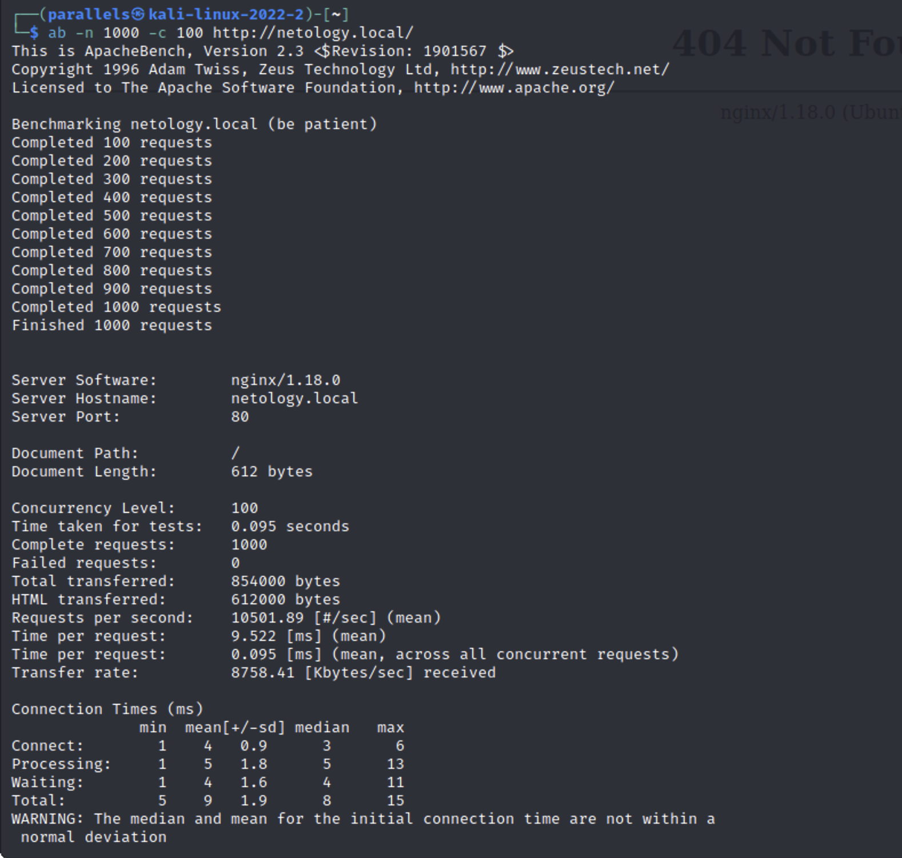
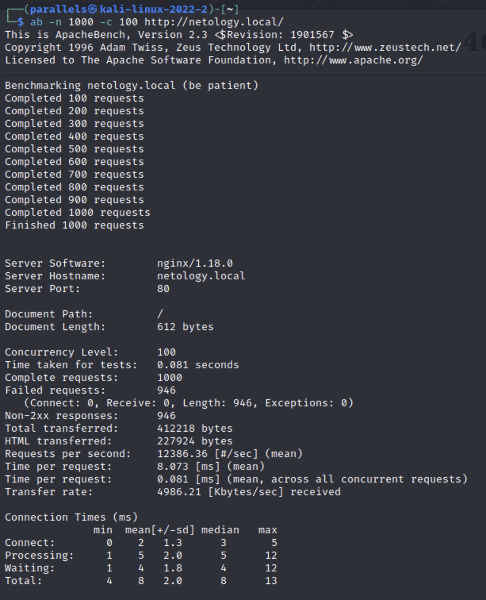
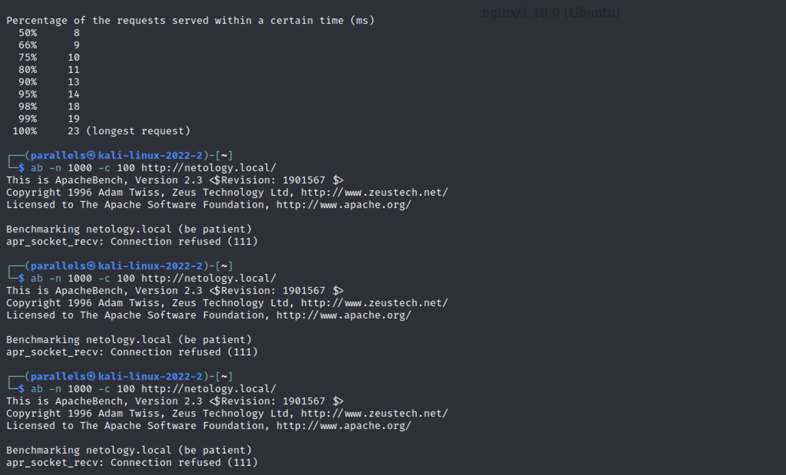

# Домашнее задание к занятию «Организация безопасности сети»

1. Скриншот с запросами `ab` до включения limit_req на nginx

   

2. Скриншот с запросами `ab` после включения limit_req на nginx

   

3. Скриншот с запросами `ab` после включения fail2ban (не обязательно)

   

   