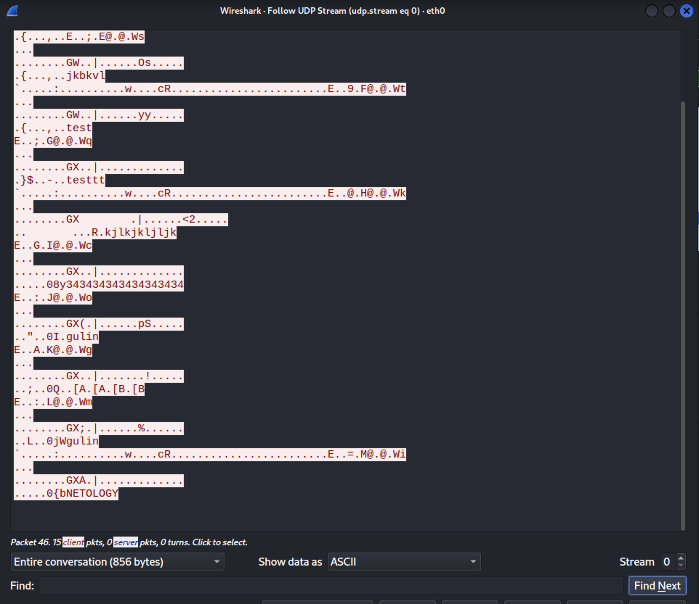
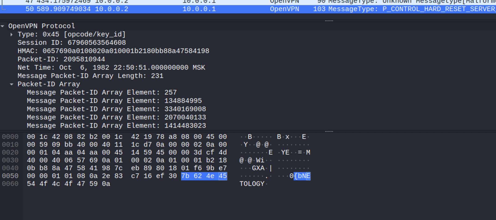
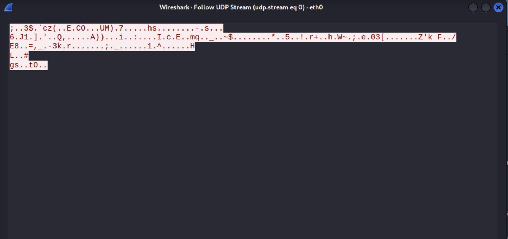
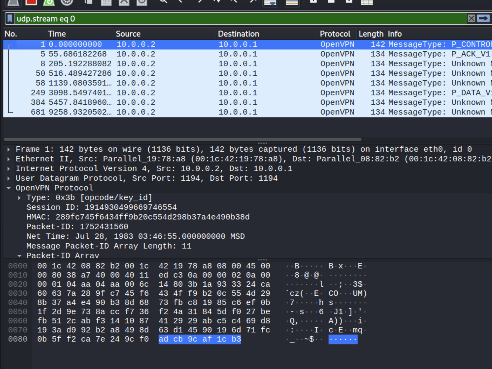

### Вопросы

1. Пришлите скриншот Wireshark, где видно, что данные передаются в открытом виде (для раздела PlainText)

***

**Ответ:**





***


2. Пришлите скриншот Wireshark, где видно, что данные не передаются в открытом виде (для раздела Shared Key)

***

**Ответ:**





***

На сервере или на клиенте запустите команду с флагом `--verb 3`, например, на Kali - `sudo openvpn --ifconfig 10.1.0.2 10.1.0.1 --dev tun --remote 10.0.0.1 --secret vpn.key --verb 3`

Внимательно изучите вывод и пришлите ответы на следующие вопросы:

3. Какая версия OpenSSL используется

***

**Ответ:** OpenSSL 3.0.3 3 May 2022

***


3. Какой алгоритм (и с какой длиной ключа) используется для шифрования

***

**Ответ:** AES-256-CBC длина шифрования - 256 бит.

***


3. Какой алгоритм (и с какой длиной ключа) используется дла HMAC аутентификации

***

**Ответ:** SHA1 длина шифрования - 160 бит.

***


Посмотреть все доступные алгоритмы с помощью команд: `sudo openvpn --show-ciphers` и `sudo openvpn --show-digests`соответственно.

***

```bash
└─$ sudo openvpn --show-ciphers
The following ciphers and cipher modes are available for use
with OpenVPN.  Each cipher shown below may be used as a
parameter to the --data-ciphers (or --cipher) option.  The
default key size is shown as well as whether or not it can be
changed with the --keysize directive.  Using a GCM or CBC mode
is recommended.  In static key mode only CBC mode is allowed.

AES-128-CBC  (128 bit key, 128 bit block)
AES-128-CFB  (128 bit key, 128 bit block, TLS client/server mode only)
AES-128-CFB1  (128 bit key, 128 bit block, TLS client/server mode only)
AES-128-CFB8  (128 bit key, 128 bit block, TLS client/server mode only)
AES-128-GCM  (128 bit key, 128 bit block, TLS client/server mode only)
AES-128-OFB  (128 bit key, 128 bit block, TLS client/server mode only)
AES-192-CBC  (192 bit key, 128 bit block)
AES-192-CFB  (192 bit key, 128 bit block, TLS client/server mode only)
AES-192-CFB1  (192 bit key, 128 bit block, TLS client/server mode only)
AES-192-CFB8  (192 bit key, 128 bit block, TLS client/server mode only)
AES-192-GCM  (192 bit key, 128 bit block, TLS client/server mode only)
AES-192-OFB  (192 bit key, 128 bit block, TLS client/server mode only)
AES-256-CBC  (256 bit key, 128 bit block)
AES-256-CFB  (256 bit key, 128 bit block, TLS client/server mode only)
AES-256-CFB1  (256 bit key, 128 bit block, TLS client/server mode only)
AES-256-CFB8  (256 bit key, 128 bit block, TLS client/server mode only)
AES-256-GCM  (256 bit key, 128 bit block, TLS client/server mode only)
AES-256-OFB  (256 bit key, 128 bit block, TLS client/server mode only)
ARIA-128-CBC  (128 bit key, 128 bit block)
ARIA-128-CFB  (128 bit key, 128 bit block, TLS client/server mode only)
ARIA-128-CFB1  (128 bit key, 128 bit block, TLS client/server mode only)
ARIA-128-CFB8  (128 bit key, 128 bit block, TLS client/server mode only)
ARIA-128-OFB  (128 bit key, 128 bit block, TLS client/server mode only)
ARIA-192-CBC  (192 bit key, 128 bit block)
ARIA-192-CFB  (192 bit key, 128 bit block, TLS client/server mode only)
ARIA-192-CFB1  (192 bit key, 128 bit block, TLS client/server mode only)
ARIA-192-CFB8  (192 bit key, 128 bit block, TLS client/server mode only)
ARIA-192-OFB  (192 bit key, 128 bit block, TLS client/server mode only)
ARIA-256-CBC  (256 bit key, 128 bit block)
ARIA-256-CFB  (256 bit key, 128 bit block, TLS client/server mode only)
ARIA-256-CFB1  (256 bit key, 128 bit block, TLS client/server mode only)
ARIA-256-CFB8  (256 bit key, 128 bit block, TLS client/server mode only)
ARIA-256-OFB  (256 bit key, 128 bit block, TLS client/server mode only)
CAMELLIA-128-CBC  (128 bit key, 128 bit block)
CAMELLIA-128-CFB  (128 bit key, 128 bit block, TLS client/server mode only)
CAMELLIA-128-CFB1  (128 bit key, 128 bit block, TLS client/server mode only)
CAMELLIA-128-CFB8  (128 bit key, 128 bit block, TLS client/server mode only)
CAMELLIA-128-OFB  (128 bit key, 128 bit block, TLS client/server mode only)
CAMELLIA-192-CBC  (192 bit key, 128 bit block)
CAMELLIA-192-CFB  (192 bit key, 128 bit block, TLS client/server mode only)
CAMELLIA-192-CFB1  (192 bit key, 128 bit block, TLS client/server mode only)
CAMELLIA-192-CFB8  (192 bit key, 128 bit block, TLS client/server mode only)
CAMELLIA-192-OFB  (192 bit key, 128 bit block, TLS client/server mode only)
CAMELLIA-256-CBC  (256 bit key, 128 bit block)
CAMELLIA-256-CFB  (256 bit key, 128 bit block, TLS client/server mode only)
CAMELLIA-256-CFB1  (256 bit key, 128 bit block, TLS client/server mode only)
CAMELLIA-256-CFB8  (256 bit key, 128 bit block, TLS client/server mode only)
CAMELLIA-256-OFB  (256 bit key, 128 bit block, TLS client/server mode only)
CHACHA20-POLY1305  (256 bit key, stream cipher, TLS client/server mode only)
SM4-CBC  (128 bit key, 128 bit block)
SM4-CFB  (128 bit key, 128 bit block, TLS client/server mode only)
SM4-OFB  (128 bit key, 128 bit block, TLS client/server mode only)

The following ciphers have a block size of less than 128 bits, 
and are therefore deprecated.  Do not use unless you have to.

DES-EDE-CBC  (128 bit key, 64 bit block)
DES-EDE-CFB  (128 bit key, 64 bit block, TLS client/server mode only)
DES-EDE-OFB  (128 bit key, 64 bit block, TLS client/server mode only)
DES-EDE3-CBC  (192 bit key, 64 bit block)
DES-EDE3-CFB  (192 bit key, 64 bit block, TLS client/server mode only)
DES-EDE3-CFB1  (192 bit key, 64 bit block, TLS client/server mode only)
DES-EDE3-CFB8  (192 bit key, 64 bit block, TLS client/server mode only)
DES-EDE3-OFB  (192 bit key, 64 bit block, TLS client/server mode only)
```

```bash
─$ sudo openvpn --show-digests
The following message digests are available for use with
OpenVPN.  A message digest is used in conjunction with
the HMAC function, to authenticate received packets.
You can specify a message digest as parameter to
the --auth option.

SHA3-512 512 bit digest size
SHA3-256 256 bit digest size
BLAKE2s256 256 bit digest size
SM3 256 bit digest size
SHA3-224 224 bit digest size
SHA384 384 bit digest size
SHA512 512 bit digest size
SHA512-224 224 bit digest size
SHAKE256 256 bit digest size
SHA256 256 bit digest size
SHA1 160 bit digest size
SHA3-384 384 bit digest size
SHAKE128 128 bit digest size
MD5-SHA1 288 bit digest size
MD5 128 bit digest size
SHA224 224 bit digest size
BLAKE2b512 512 bit digest size
SHA512-256 256 bit digest size
KECCAK-KMAC-128 256 bit digest size
KECCAK-KMAC-256 512 bit digest size
NULL 0 bit digest size
```


***

Указать конкретные с помощью флага `--cipher`, например, `--cipher AES-128-CBC` (или просто `--cipher AES128`) и `--auth`, например, `--auth SHA256`, соответственно (удостоверьтесь, что после указания иных алгоритмов в логе вывод тоже меняется).

***

```bash
$ sudo openvpn --ifconfig 10.1.0.2 10.1.0.1 --dev tun --remote 10.0.0.1 --secret vpn.key --providers legacy 
2022-10-11 22:46:25 Outgoing Static Key Encryption: Cipher 'CAMELLIA-128-CBC' initialized with 128 bit key
2022-10-11 22:46:25 Outgoing Static Key Encryption: Using 288 bit message hash 'MD5-SHA1' for HMAC authentication
```


***

6. Что будет выведено в консоли сервера (`sudo openvpn --ifconfig 10.1.0.1 10.1.0.2 --dev tun --secret vpn.key --cipher AES128 --auth SHA256 --verb 3`), если:

6.1. Подключиться с клиента командой: `sudo openvpn --ifconfig 10.1.0.2 10.1.0.1 --dev tun --remote 10.0.0.1 --secret vpn.key --cipher AES256 --auth SHA256 --verb 3`

***

**Ответ:**

```bash
Authenticate/Decrypt packet error: cipher final failed
```

Пишет, что шифрование на конечном устройстве сломано. Из-за несоответствия стандартов шифрования.

***


6.2. Подключиться с клиента командой: `sudo openvpn --ifconfig 10.1.0.2 10.1.0.1 --dev tun --remote 10.0.0.1 --secret vpn.key --cipher AES128 --auth SHA512 --verb 3`

***

**Ответ:**

```bash
Authenticate/Decrypt packet error: packet HMAC authentication failed
```

Авторизация сломана. Из-за несоответствия HMAC стандартов шифрования.

***

