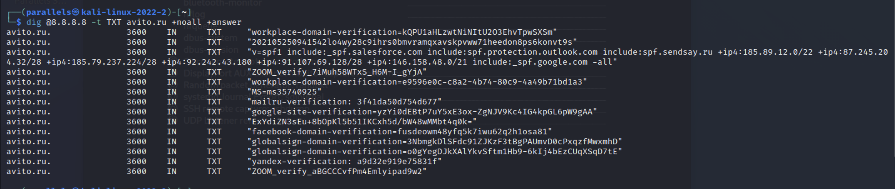
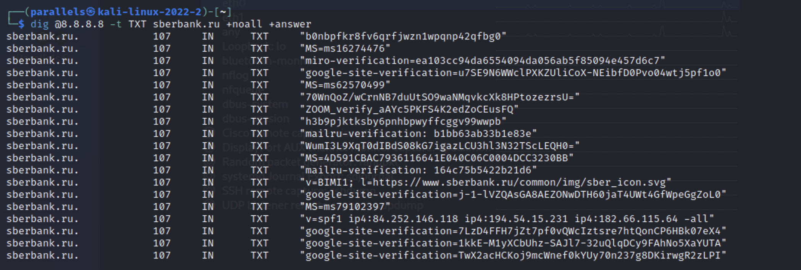
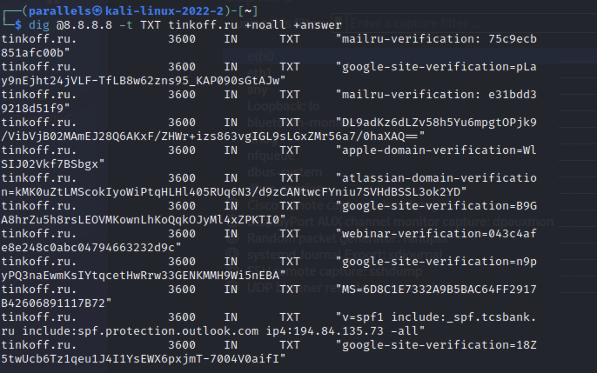
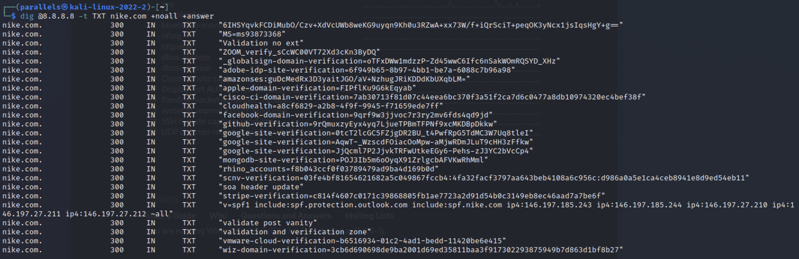
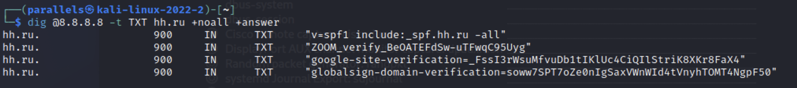

# Домашнее задание к занятию «Работа сети Интернет (часть 1): BGP, DNS»

В качестве результата пришлите ответы на вопросы в личном кабинете студента на сайте [netology.ru](https://netology.ru/).

## Zoom

На любой Linux-машине (можете использовать Kali) с помощью утилиты dig найдите 5 компаний (доменов), которые скорее всего используют Zoom для своей работы.

В качестве результата необходимо отправить:

1. Описание (своими словами) как вы производили поиск

   ***

   **Ответ:** Поиск я производил отталкиваясь от возможностей сервиса ZOOM и его потенциальных потребителей. В задании мы ищем код верификации ZOOM, который используется в случаях, когда компания хочет использовать свои домены в сервисе видеозвонков. Из этого можно было сделать вывод, что как правило подобным образом поступают компании, предлагающие услуги и консультации, также возникла мысль, что крупные бренды скорее всего используют ZOOM для своих сотрудников.

   ***

   

2. Список из 5 доменов

   ***

   **Ответ:**

   - tinkoff.ru
   - avito.ru
   - sberbank.ru
   - tinkoff.ru
   - nike.com

   ***

   

3. Скриншоты вывода dig для каждого домена

   ***

   **Ответ:**

   

   

   

   

   

   ***

   

