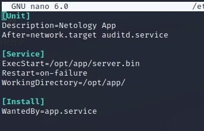
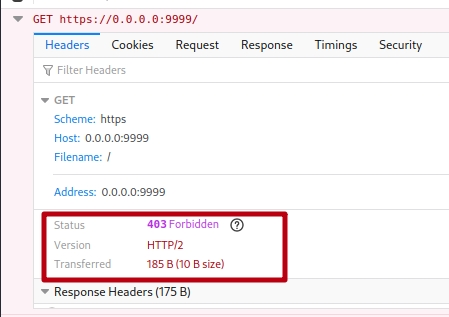

# Домашнее задание к занятию «ОС Linux (часть 2)»

С помощью `journalctl` отследите, лог приложения (не менее 2х минут) и пришлите:

1. Скриншот, либо содержимое файла `app.service`

   

2. Ответы на вопросы:

   1. На каком IP и порту запускается сервис

      **Ответ:** 

      На IP 0.0.0.0 и порту 9999

   2. Кто (IP и порт) шлёт запросы на этот сервис и на какой путь

      **Ответ:** 

      Шлет с локального адреса 127.0.0.1 и портов 59402, 59404, 59406, 59408, 59410, 59412, 59414, 59416, 59418 по пути /api/token

      ```bash
      Dec 05 03:02:36 kali server.bin[2679]: 2022/12/05 03:02:36 starting server on 0.0.0.0:9999
      Dec 05 03:02:36 kali server.bin[2679]: 2022/12/05 03:02:36 current working directory: /opt/app
      Dec 05 03:02:46 kali server.bin[2679]: 2022/12/05 03:02:46 incoming request GET /api/token from 127.0.0.1:59402 UA tracker-service
      Dec 05 03:02:46 kali server.bin[2679]: 2022/12/05 03:02:46 {"ID":"5dc5c2cd2d07bc60d9dc","status":"ok"}
      Dec 05 03:02:56 kali server.bin[2679]: 2022/12/05 03:02:56 incoming request GET /api/token from 127.0.0.1:59404 UA tracker-service
      Dec 05 03:02:56 kali server.bin[2679]: 2022/12/05 03:02:56 {"ID":"75356199b9dcd182c8ca","status":"ok"}
      Dec 05 03:03:06 kali server.bin[2679]: 2022/12/05 03:03:06 incoming request GET /api/token from 127.0.0.1:59406 UA tracker-service
      Dec 05 03:03:06 kali server.bin[2679]: 2022/12/05 03:03:06 {"ID":"0506685e9bc25b932bdc","status":"ok"}
      Dec 05 03:03:16 kali server.bin[2679]: 2022/12/05 03:03:16 incoming request GET /api/token from 127.0.0.1:59408 UA tracker-service
      Dec 05 03:03:16 kali server.bin[2679]: 2022/12/05 03:03:16 {"ID":"37dfe361289192c0a01d","status":"ok"}
      Dec 05 03:03:26 kali server.bin[2679]: 2022/12/05 03:03:26 incoming request GET /api/token from 127.0.0.1:59410 UA tracker-service
      Dec 05 03:03:26 kali server.bin[2679]: 2022/12/05 03:03:26 {"ID":"6644ab012d23845b3485","status":"ok"}
      Dec 05 03:03:36 kali server.bin[2679]: 2022/12/05 03:03:36 incoming request GET /api/token from 127.0.0.1:59412 UA tracker-service
      Dec 05 03:03:36 kali server.bin[2679]: 2022/12/05 03:03:36 {"ID":"dde694468047fa3acf8f","status":"ok"}
      Dec 05 03:03:46 kali server.bin[2679]: 2022/12/05 03:03:46 incoming request GET /api/token from 127.0.0.1:59414 UA tracker-service
      Dec 05 03:03:46 kali server.bin[2679]: 2022/12/05 03:03:46 {"ID":"56af4a140cfb8adc7f30","status":"ok"}
      Dec 05 03:03:56 kali server.bin[2679]: 2022/12/05 03:03:56 incoming request GET /api/token from 127.0.0.1:59416 UA tracker-service
      Dec 05 03:03:56 kali server.bin[2679]: 2022/12/05 03:03:56 {"ID":"b00d02b21514b9fe2292","status":"ok"}
      Dec 05 03:04:06 kali server.bin[2679]: 2022/12/05 03:04:06 incoming request GET /api/token from 127.0.0.1:59418 UA tracker-service
      Dec 05 03:04:06 kali server.bin[2679]: 2022/12/05 03:04:06 {"ID":"322ff9cac3baca48542e","status":"ok"}
      ```

      

   3. Какие ответы (формат) получает клиент из п.ii получает в ответ на свои запросы

      **Ответ:** 

      формат ответа: {ID,status}

      ```bash
      {"ID":"322ff9cac3baca48542e","status":"ok"}
      ```

      

   4. Какой ответ (HTTP статус код) получите вы, если пошлёте из браузера запрос на этот же адрес (сертификат самоподписанный, поэтому вам необходимо принять его)

      **Ответ:** 

      Status403 Forbidden, т.е. доступ запрещен.

      

      