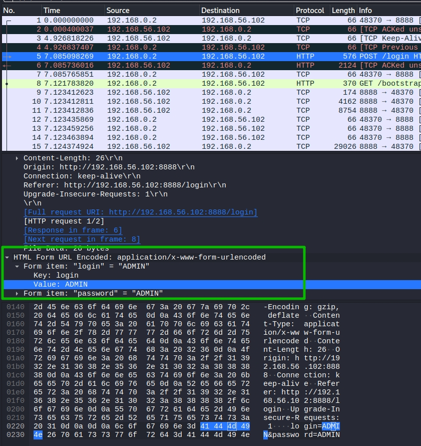

1. # Курсовая работа "Защищённый контур" (Профессия Специалист по информационной безопасности)

   ## Легенда

   Компания Х использует корпоративное сетевое приложение "Защищённый контур", позволяющее "безопасно" обмениваться корпоративной информацией (в том числе хранить персональные данные клиентов и информацию, отнесённую к коммерческой тайне). Вам предстоит проанализировать само приложение на уязвимости, а также настройки ОС на серверах, где это приложение функционирует.

   Компания разработчик поставляет уже настроенный сервер в виде [OVA](https://drive.google.com/file/d/16uICxKQN91ZqjGa5a9AGml_WqG4oVXzp/view?usp=sharing) (md5 = 5935192d257a003b85584a84dec83367), который (по их заверениям) вполне безопасен и может использоваться "из коробки" (т.е. достаточно импортировать в среду виртуализации и можно запускать в боевой среде).

   По информации, полученной от разработчика, цитата: "приложение содержит механизмы безопасности и может использоваться при построении ИСПД до 4 УЗ включительно и систем, обрабатывающих коммерческую тайну".

   Документация на приложение разработчиком не предоставлена, поскольку, цитата: "интерфейс интуитивно понятный, обучающих материалов для пользователей не требуется".

   Исходные коды так же не предоставлены.

   Вас, как специалиста, попросили выполнить анализ данного приложения с точки зрения его реальной защищённости.

   ## Техническая информация

   Цитата:

   ```
   Логин/пароль пользователя в ОС OVA - system/system (после первого запуска необходимо сменить пароль).
   
   Все файлы приложения располагаются в каталоге /opt/sk
   
   Приложение предназначено для работы в ОС Linux x86_64
   
   Приложение настроено в качестве сервиса systemd - sk.service
   
   Приложение запускается на порту 8888 и использует протокол HTTP для своей работы, взаимодействие с приложением осуществляется через веб-интерфейс (посредством веб-браузера)
   
   При первом старте в приложении регистрируется пользователь с логином admin, пароль генерируется автоматически и записывается в файл /opt/sk/password.txt
   ```

   ## Задача

   Подготовьте отчёт о:

   1. Найденных несоответствиях системы требованиям нормативных документов*
   2. Найденных "слабостях" (которые могут привести к уязвимостям) и предложение по необходимым мерам для их устранения (если такие меры возможно принять).

   Формат отчёта - свободный, но обязательно должен включать указанные выше два пункта.

   Примечание*: в части документов нужно:

   1. ПДн: реализация мер по обеспечению безопасности в части ИАФ, УПД
   2. КТ: "разрешение или запрет доступа к информации, составляющей коммерческую тайну" посредством механизмов разграничения доступа, встроенных в приложение (механизмы ОС и сторонних сервисов рассматривать не нужно)

   **Важно**: вы можете использовать любые техники из пройденных на предыдущих курсах: от сканирования портов, подбора паролей, анализа бинарных (исполняемых) файлов до попыток "уронить" приложение, выполнить произвольный код и т.д.

   **Важно**: если в части документации нужно рассматривать только само приложение, то в части поиска слабостей вы можете рассматривать и окружение приложения (ОС и сервисы).

   **Подсказка**: Попробуйте пройтись по [CWE TOP 25 2020](https://cwe.mitre.org/top25/archive/2020/2020_cwe_top25.html), не обращая внимания на то, что мы ещё не прходили (SQL, CSRF, XML и т.д.).

   ## Критерии сдачи

   1. Подготовлен отчёт
   2. Найдено не менее 2х слабостей системы, ведущих к реальным уязвимостям, которые вы проэксплуатировали (т.е. нужно: слабость -> уязвимость -> описание процесса эксплуатации -> полученный результат).


# Отчет


http://pdsec.ru/4_uroven/


В ходе изучения корпоративного сетевого приложения "Защищённый контур" от компании Х был выявлен ряд несоответствий системы требованиям нормативных документов, а именно:

1) Отсутствие некоторых мер по обеспечению безопасности ПдН УЗ 4, согласно приказу ФСТЭК №21:

   - УПД.6. Не реализовано ограничение неуспешных попыток входа в информационную систему (доступа к информационной системе). Влечет за собой риск подбора пароля администратора или пользователя методом перебора (брутфорс). Рекомендация - добавить ограничение на количество неудачных попыток, после истечения которых временно блокировать учетную запись.

   - ИАФ.5. Отсутствует защита обратной связи при вводе аутентификационной информации. При вводе пароля поле ввода не должно дать возможности лицу, не допущенному к данной системе увидеть вводимые символы и количество введенных символов. Рекомендация - скрыть символы и длину пароля при вводе.

   - УПД.3. Для доступа к системе используется незащищенный протокол http, который передает данные в открытом виде и позволяет их перехватить или заменить. Рекомендация - использовать криптозащищенный протокол https. Пример перехвата логина и пароля возможен в ситуации "Человек посередине". Пример из анализатора трафика ниже

     

     

2) Доступ к странице, содержащей коммерческую тайну доступен без авторизации на сайте по прямой ссылке: http://192.168.56.102:8888/administrate/index.html. Рекомендации - настроить ограничение доступа к страницам сервиса по прямой ссылке неавторизованным пользователям и пользователям, не состоящим в группе "КТ".

3) Не оформлен порядок эксплуатации АС документально.

4) Не ведется логирование действий пользователей и администраторов в системе.


При проверке системы были выявлены следующие уязвимости:

1. Удаленный отказ в обслуживании (Dos-атака). На сервере используется уязвимая версия протокола ftp vsftps 3.0.3. Для эксплуатации уязвимости достаточно запустить скрипт из статьи https://raw.githubusercontent.com/prodseanb/vsftpd-3.0.3-DoS/master/vsftpd303-dos.py с нескольких прокси . Рекомендация - обновить версию vsftps.
2. CVE-45233. Уязвимость протокола OpenSSH версии <7.7. Позволяет выявить учетные записи пользователей ОС. Можно использовать Metaisploite framework для эксплуатации данной уязвимости. Необходимо будет подгрузить список пользователей. После сканирования в терминале выведется список пользователей, которые были найдены в системе из файла. Рекомендации - обновить OpenSSH. 
3. Не настроен межсетевой экран, что позволяет проводить сканирование портов и последующую атаку. Рекомендация - настроить межсетевой экран (UFW).
4. Пароль администратора сервиса хранится в открытом виде, что недопустимо. Рекомендация - хранить хэш пароля в БД.
