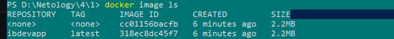
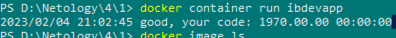
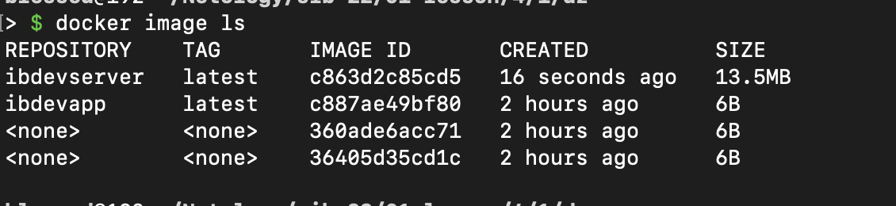
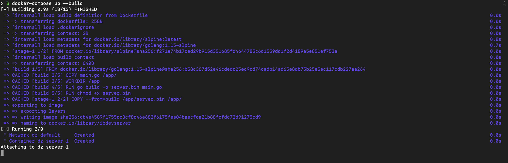

# Домашнее задание к занятию «1.1. Контейнеризация (Docker)»

## Задание №1. Создание Docker Image

1. Скриншот вывода команды `docker image ls`.

   

2. Скриншот вывода команды `docker container run ibdevapp`.

   

   

## Задание №2. Multistage Build

1. Скриншот вывода команды `docker image ls`.

   

2. Скриншот вывода команды `docker-compose up --build`.

   

## Задание №3. CIS Benchmarks*

1. Мы не создали отдельного пользователя для запуска контейнеров.
2. Мы не убедились в происхождении образов и их безопасности.