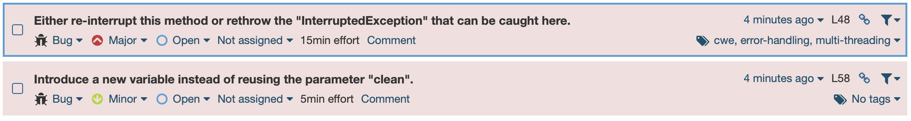

# Домашнее задание к занятию «1.2. Популярные языки, системы сборки, управления зависимостями»

### Результаты выполнения

1. Какие баги были выявлены: количество, описание, почему SonarQube их считает багами? См. ссылку `Why is this an issue?`.

   **Ответ:**

   - Не рекомендуется игнорировать исключения, т.к. информация о том, что поток был прерван может быть упущена, а значит задача может быть не завершена. Поток следует повторно прервать через Thread.interrupt(), т.к. InterruptedExceptions очищает прерванное состояние потока.

   - Рекомендуется назначать начальные значения переменных метода до метода, а не из тела метода. 

   

2. Какие уязвимости были выявлены: количество, категории, описание, почему SonarQube их считает уязвимостями?

   **Ответ:** Было найдено, что база данных не защищена паролем. 

   

3. Какие Security Hotspots были выявлены: количество, категории, приоритет, описание, почему SonarQube их считает Security HotSpot'ами?

   **Ответ:** Здесь судя по всему не убрали функции отладки, которые позволяют разработчикам находить ошибки, но облегчают работу злоумышленникам, т.к. часто это дает доступ к подробной информации о системе и о пользователях.

   

4. К каким CWE идёт отсылка для Security Hotspots из п. 2? См. вкладку `How can you fix it?` в нижней части страницы.

   **Ответ:** CWE-521: Weak Password Requirements

5. Какие запахи кода были выявлены: количество, описание, почему SonarQube их считает запахами кода? См. ссылку `Why is this an issue?`.

   **Ответ:** было выявлено 5 запахов кода.

   

   - Присутствует неиспользуемый импорт.Рекомендуется убрать, т.к. может ввести в заблуждение и код становится менее читаемым.
   
   - Не рекомендуется использовать стандартную функцию вывода в ситуации с логированием входа, т.к. это может не выполнить все требования:
   
     - Пользователь должен легко получить доступ к логу
     - Формат лога должен быть универсальным
     - Должна вестить запись данных 
     - Чувствительные данные должны логироваться защищенно
   
   - Условие всегда истинно. В нем нет смысла, если оно не меняется.
   
   - Рекомендуется использовать специальное исключение вместо универсальных (Error, RuntimeException, Throwable, Exception), т.к. в итоге путаются выводы ошибок приложения и системные исключения.
   
     